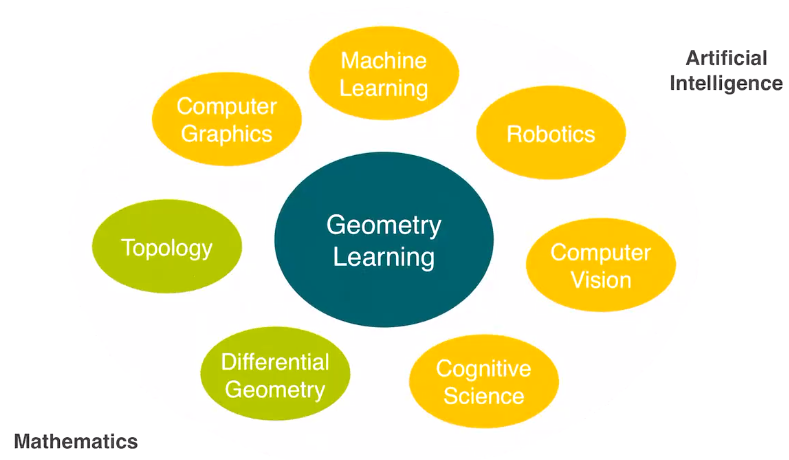
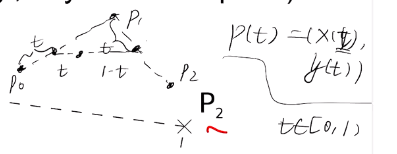
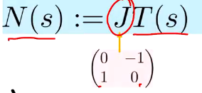
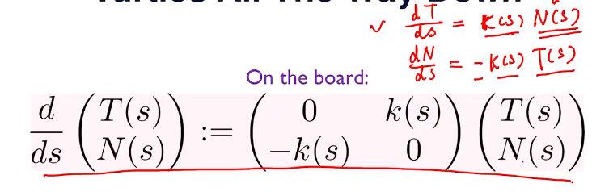
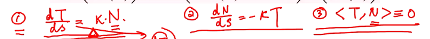
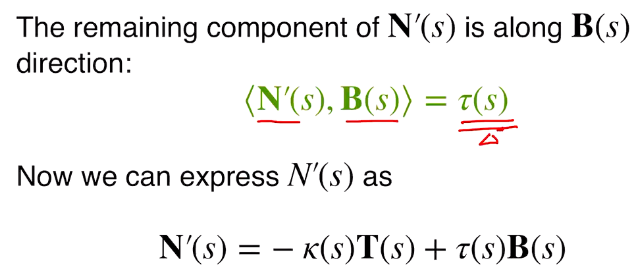
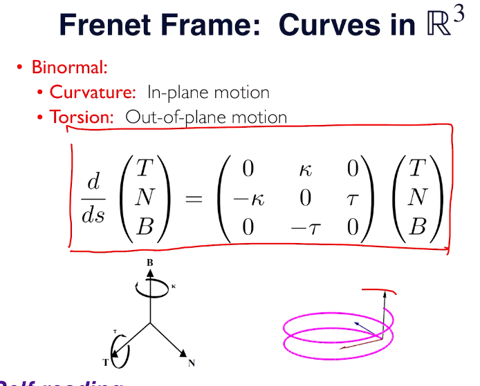

## L1:introduction

* ml: prior info
* topics covered:
  * geo theories
  * computer expression
  * sensing: 用传感器进行3D reconstruction，如：
    * 单张图片重建三维形状（病态，因此ml带来的先验信息重要：analysis understanding（？））
    * 多视角重建：传统或ml（困难：透明/反光等特殊光学材质）
  * geo processing：局部几何特征、表面重建
  * recognition：
    * 物体检测（bounding box+朝向信息）/分类，
    * 位姿信息（6D pose estimation，也就是3维位置信息+3维朝向信息（即SO3，位姿）），
    * segmentation，
    * human pose estimation（skeleten：单个部件也是6D，但每个关节减少一个自由度）
  * relationship analysis：关系，有助于知识迁移

### curve

* 先讲连续的
* implicit representation：隐式方程
* explicit 。。。。。。。：显式函数式
* parameterized 。。。。：参数式（有时也当作显式的一类）
* 以点控制（指定）曲线形状

  * 贝塞尔曲线（问题：每个控制点都会影响曲线每一点的坐标，如果点数很多时阶次太高，。。。）

    
  * 样条（如B-splines）
* 我们关注的：一维流形（局部像条直线）
* 不是一维流形的：

  * 有“尖点”（注意：x(t),y(t)连续不代表曲线是一维流形))）
  * 有交叉点
* 切向量：各分量求导

  * 方向：运动方向；大小：运动速度
* 曲线长度（弧长）：对切向量模关于参数的积分
* 弧长参数：用弧长s代替参数t，则速度为定值1
* 弧长参数下：

  * 切向量（模总是1）
  * 法向量（切向量逆时针旋转90°，模也总是1）

    
* 更好推广的定义：重新定义K(s)是以s为参数时得到的切向量再对s求导后的模长（其实就是曲率）

  * 
* TFAE

（ppt中主要是1推2和3（需要限定T和N的模长都是1），2推1和3完全与之对称，3推1和2就是最后一行确定共线关系后再定系数）

* curvature（曲率K）（恒正）

  * 是T或N导数的模长，易于推广的是N导数的形式
  * （轴向）加速度
  * 曲率半径：曲率的导数
* 二维曲线基本定理：曲率可以唯一刻画一条二维曲线，且具有刚体运动不变性（本质的不变量）
* 3D curve
* osculating plane：由一点上的T和N定义的平面
* binormal vector：T×N，是osculating plane的法向量
* torsion（扭矩？）$\tau$ （不一定恒正）

* 从N角度来看，K刻画了其在T方向的变化，$\tau$刻画了其在B方向上的变化
* B的导数和N共线反向，大小为$\tau$
* 
* 三维曲线基本定理：曲率+torsion可以唯一刻画一条三维曲线，且具有刚体运动不变性（本质的不变量）
  * 反例：螺旋线一个向上转，一个向下转
* curve本质:R->R^n
