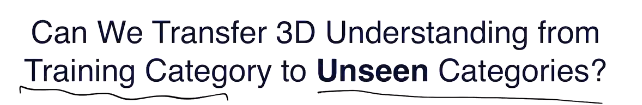
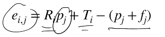

### zero-shot learning

* ml里面的问题有很多也可以成为3D的问题
* 当数据没有很好的标注时，如何处理
* 一般认为：数据集iid取样，学习一个f，loss设置
* universality theorem
* source domain
* target domain（label不止）
* 两个domain数据（训练集、测试集）分布不同时，对结果有一定影响
* 

#### correspondence-base segmentation

* motivation：有关节（转轴）可以运动的物体，如何从其多种形态分析有哪些部分
* 希望可以做到对没见过的物体也能分出部分
* correspondence可能和局部关系更相关，因此有可能实现对没见过物体的分析
* 纯监督网络也能做，但和动与不动无关，且没法泛化到没见过的东西上
* 则把prior放进pipeline中去
* 获取correspondence方法：
  * 抽每个点的特征（pointnet++），然后比较（比较方法：mlp）匹配（匹配概念）
  * 但注意两个点云未必点点对应，因此需要额外预测哪些点不在另一个点中（必须在softmax前进行预测）
  * 这部分需要单独训练
* correspondence——deformation flow，每个点都有了一个移动向量
  * 方法：定义pairwise displacement mat（点点间距离）
  * 此mat和前面的概率矩阵按每个关系连接
  * 过pointnet预测相对于某个点云的点点上的flow representation，然后再过pointnet++预测flow
  * 这种结构可以称为pairnet
* flow——segmentation
  * 从flow中提取，由于是rigid motion则可以据此预测
  * flow误差较大，因此不建议解析方式进行，而应考虑learning
  * 好办法：RANSAC（对多模态也适用）（先分析出一个模态，去掉，再分析下一个）
    * 每个点生成对其所在part的deformation的估计（R,T）（单独监督pointnet++）
    * 
    * 当e很大，则i和j可能不是跟随同一个rigid motion，因此可能不处于同一个part
    * 过pointnet，得到每个点与其他点在同一个part的概率
    * 提取模态的方法：pairnet提取一个模态，然后调整hidden state（support matrix），然后再提取下一个
    * 提取过程中同时要预测一个可信度，若过低则停止
* 预测时：iter，得到的seg结果又送回一开始的correspondence模型，从而迭代优化质量
* 可以handle没见过的data（因此训练时直接用人造数据即可）
