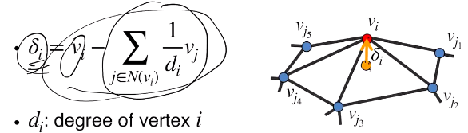
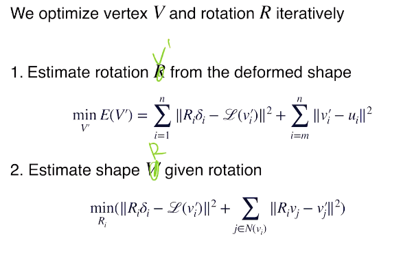
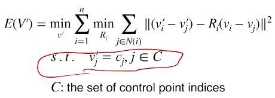

### zero-shot learning

* ml里面的问题有很多也可以成为3D的问题
* 当数据没有很好的标注时，如何处理
* 一般认为：数据集iid取样，学习一个f，loss设置
* universality theorem
* source domain
* target domain（label不止）
* 两个domain数据（训练集、测试集）分布不同时，对结果有一定影响
* 

#### correspondence-base segmentation

* motivation：有关节（转轴）可以运动的物体，如何从其多种形态分析有哪些部分
* 希望可以做到对没见过的物体也能分出部分
* correspondence可能和局部关系更相关，因此有可能实现对没见过物体的分析
* 纯监督网络也能做，但和动与不动无关，且没法泛化到没见过的东西上
* 则把prior放进pipeline中去
* 获取correspondence方法：
  * 抽每个点的特征（pointnet++），然后比较（比较方法：mlp）匹配（匹配概念）
  * 但注意两个点云未必点点对应，因此需要额外预测哪些点不在另一个点中（必须在softmax前进行预测）
  * 这部分需要单独训练
* correspondence——deformation flow，每个点都有了一个移动向量
  * 方法：定义pairwise displacement mat（点点间距离）
  * 此mat和前面的概率矩阵按每个关系连接
  * 过pointnet预测相对于某个点云的点点上的flow representation，然后再过pointnet++预测flow
  * 这种结构可以称为pairnet
* flow——segmentation
  * 从flow中提取，由于是rigid motion则可以据此预测
  * flow误差较大，因此不建议解析方式进行，而应考虑learning
  * 好办法：RANSAC（对多模态也适用）（先分析出一个模态，去掉，再分析下一个）
    * 每个点生成对其所在part的deformation的估计（R,T）（单独监督pointnet++）
    * 
    * 当e很大，则i和j可能不是跟随同一个rigid motion，因此可能不处于同一个part
    * 过pointnet，得到每个点与其他点在同一个part的概率
    * 提取模态的方法：pairnet提取一个模态，然后调整hidden state（support matrix），然后再提取下一个
    * 提取过程中同时要预测一个可信度，若过低则停止
* 预测时：iter，得到的seg结果又送回一开始的correspondence模型，从而迭代优化质量
* 可以handle没见过的data（因此训练时直接用人造数据即可）

#### 第二种（还是seg问题）

* combination of known parts
* zero-shot part seg，no semantic info
* bottom-up的泛化能力更强（小part更加通用）
* 先聚类得到小部件
* 然后对小部件合并：训练一个网络判断两个小部件能否合并；因为是针对小部件的，因此更加通用
* 问题：较为复杂（如果小部件是随机抽取的）
* 解决：训练一个模型，有助于快速选出更可能合并的parts
  * RL，action是所有part对
  * score是由和gt的overlap程度确定的
  * 策略梯度法

### L16 deformation

* 分类：

  * flow
  * box（space）（控制点）
  * skeleton
* 近似isometric deformation
* 指定deform的约束
* 应该自然，且约束不用加得特别多

surface deformation

（针对mesh，则只要指定vertex的位移即可）

* laplacian surface editing
  * nature：preserve local geo：curvature（I标准形）+metric（II标准形）
  * 只指定一部分点，余下点用插值等确定
  * Laplacian可以近似mean curvature
  * 
  * **laplacian matrix**（？）
  * $\delta$的长度近似和mean curvature相等
  * 定义Energe func
    * deform后的一部分点和ctrl pts尽可能接近（即是软约束）
    * deform后对应点上的Laplacian尽可能接近
  * 问题：不应考虑δ的normal的信息
    * 因此加一个估计每个局部的rotation的环节，于是就不会保留方向信息了（方向信息进入R了）
    * 不过这样就非凸了，因此交替估计R和v`
    * 
    * （注意估计R时是分开每个点估计一个Ri，且第二项平动会被减掉因此不用写，**第一项的vi`也要写成Rivi**）
    * 第一步估计：二阶优化，有闭式解
    * 第二步估计：orthogonal procrustes，用SVD解出，也有闭式解
* ARAP：as rigid as possible deformation（能够同时保留曲率和测度信息）
  * cell：一顶点和其邻点
  * 定一个energe，应在streching和bending时允许E有变化，而和rigid motion无关
  * 每个cell中
  * 注意长度和方向都会preserve（上面是矢量差的模的最小化！），即每条边向量在rigid motion后可以不变
  * 总的loss：
  * 
  * 又是交替优化
  * 现在还是非常流行的，且扭曲更小

下一讲：更快的方法
