### 续surface deformation

* Laplacian
* ARAP
* 以上计算太慢

#### space deformation

* 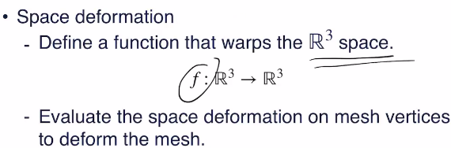
* 最后作用还是作用在各个顶点上，但是这种函数形式易于学习
* 联想：贝塞尔曲线
* control pt不一定在surface上，控制点散布在空间中（如格点分布**模理论可有用武之地？**）
* 各点的deformation是控制点deformation的线性组合，系数由对应点的坐标唯一确定
* 例：分维度tricubic贝塞尔
* 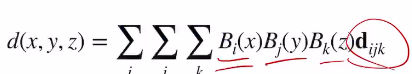
* 问题：
  * lattice过密则modeller工作量过大，反之则不够精细
  * ctrl pt和最终形状的关系不显式
  * 减少ctrl pt：
    * cage deformation
    * key-point（可以用ml学习出好的关键点）
* 以上是传统方法
* 特点：快，real time，没法保持curvature等

#### skeleton skinning

* 分两步：先定骨架，然后蒙皮
* 骨架：SE3（rigid motion），可以定义一个rest pose（如人体就是T型）
* 骨架的pose之间还有一些约束
* modeller的工作就是控制骨架
* 蒙皮：
  * linear blend skinning
    * 初级方法：每个vertex归属各个骨架，骨架的运动直接对应施加到vertex上。问题是在关节处会撕裂
    * 改良：每个vertex关于各个bone都有权重值（skinning weights），最终的运动是加权和（现在用的还是很多）
    * 问题：SE3 group并不对加法封闭（群是对其上的乘法封闭），即所谓“平均旋转”并非一个良定义的概念（参考讨论：https://www.zhihu.com/question/439497100，里面有一些工程上的处理方法）
    * **关于lie algebra有一则17页paper参考**
    * 反而可以考虑一下如何（沿何种路径）插值（其实就是四元数下沿球面插值（参考：SLERP））
    * 问题二：指定weights较为复杂
  * 可用软件：blender

### L18 surface reconstruction

一般就是关注点云转为mesh

* 要求：快、robust、尽量满足一些对高质量mesh的要求（manifold、watertight）
* 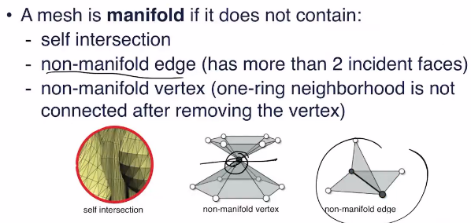
* 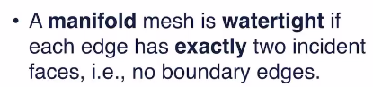watertight：可分内外
* explicit alg：直接连接点云的点

  * ball-pivoting
    * 输入：点云+足够大的超参ρ
    * 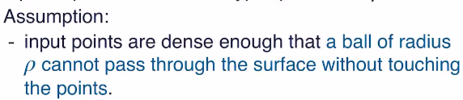
    * 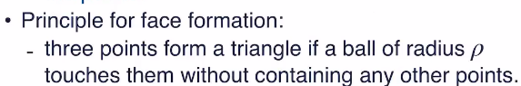
    * **这里的意思是至少有两个点要在圆上**
    * 至少三角形大小被限制住了，不会有过大或过小的三角（ρ就是三角形大小的prior）
    * 算法：先在边缘（找xyz极值等）找一个边，然后逐个点地检测是否符合条件
    * 问题：
      * ρ太小则出现hole
      * 太大则会把细节忽略掉
      * 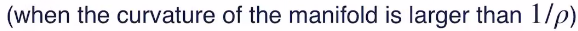
      * 改进：变ρ：iter
        * 先用小ρ，有很多hole
        * 再用大ρ，只作用在hole上，填洞
    * 问题二：
      * 容易产生粘连（歧义性的结构）
      * 总体效果上不如extrinsic-intrinsic ratio的方法
  * extrinsic-intrinsic ratio（之前讲过）
  * expilcit方法的特点
    * 线性复杂度，不需要normal
    * 可能non-manifold，no watertight guarantee
    * sr过低则learning也救不回来
* implicit alg：点云——SDF——mesh

  * poisson surface reconstruction（讲过）
  * RBF
    * radial basis function：只与和定点距离相关的函数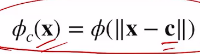
    * 把SDF表示成RBF的加权和，再加一个多项式
      * 原因：一般Φ函数会规定在x=c处取0，其余>0；另外一般希望加的权是正的（从而有物理意义，表示辐射强度），因此必须要加个什么东西offset
      * 如果只要求点云各点SDF为0，则可能trivial solution=f=0，因此加点normal的条件：
      * 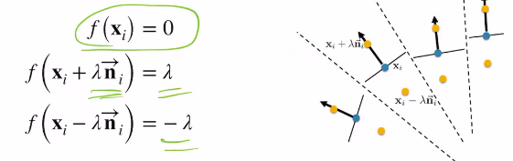
      * 问题：点云的normal未必是可定向（有内外的、consistant）
      * 通常用learning的方式搞consistant的normal
      * 然后就可以直接解方程
      * 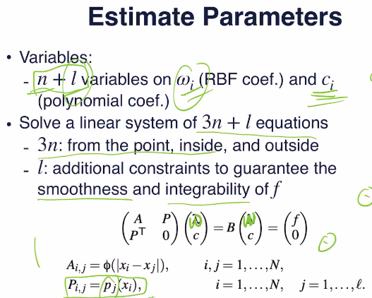
      * 其中有l个方程是添加进去的，即多项式的基在各点的取值组成的向量组和权向量ω正交（**原理待考，参考https://www.cs.jhu.edu/~misha/Fall05/Papers/carr01.pdf，**）
      * 原理有几种解释
        * 为了保证解出的插值函数在BL(2)空间中，即二阶微分平方可积。但没有找到证明。
        * 为了保证解的唯一性。但并不能说明为何不选用其他条件
        * 为了使得目标函数比P的阶次低时完全由多项式进行估计，而让基函数的权全为0。但意义不是很明显。
        * 参考：
        * https://math.stackexchange.com/questions/2318250/what-does-it-mean-that-the-interpolants-are-choosen-from-bl-space-of-distributi
        * https://pdf.sciencedirectassets.com/272427/1-s2.0-S0021904505X04245/1-s2.0-S0021904505001450
        * https://math.stackexchange.com/questions/2297728/kernel-of-seminorm
        * https://num.math.uni-goettingen.de/schaback/teaching/sc.pdf
        * https://www.tandfonline.com/doi/pdf/10.1080/16583655.2018.1469293
        * https://www.math.tamu.edu/~francis.narcowich/psfiles/rbf.pdf
        * http://shihchinw.github.io/2018/10/data-interpolation-with-radial-basis-functions-rbfs.html
        * https://www.colorado.edu/amath/sites/default/files/attached-files/2016_ffbb_rbf-fd_i_interpolation_jcp_submitted.pdf
      * 其他：通常用Φ=r^3（用高斯则每个点只能有很局部的信息，其他地方的信息传达不到，r^3则距离可以传得很远），poly通常3阶即可
      * 通常会只挑几个关键点
    * 平滑以减小噪声
  * 从SDF到mesh：marching cube
    * 注意SDF可能有offset，因此要有个threshholding，最终变成01变量
    * lookup table（共256种，不过考虑旋转等则只有15种），根据每个局域（cubic八元组）的01情况查表得到一个初始的不光滑的猜测
    * refine，插值
    * 问题：有歧义，容易产生窟窿：
    * 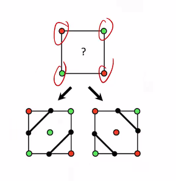
    * 一种方法：造更复杂的cube，或是使用多个cube的信息
  * 和前面讲过一样，可以用net估计SDF，shapecode等
* 问题：需要normal consistant orientation

  * 想法：用一个unsigned SDF，则不需要定向了（如到点云的距离）
  * 把signed SDF取绝对值，应该能和unsigned SDF近似相等
  * 用一个model取绝对值后去学习unsigned sdf，问题是不希望model直接学了unsigned sdf，我们希望其学习到signed的版本
  * 如何实现这一点？初始化（构造方法见文章）：
  * 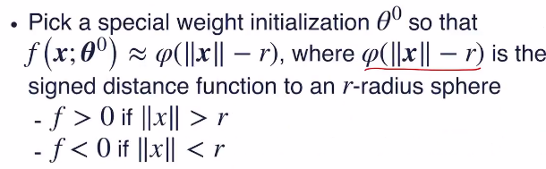

### L20 mesh processing
