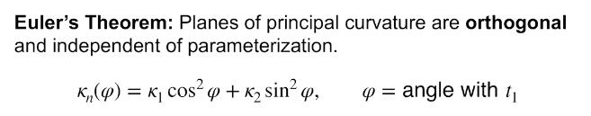
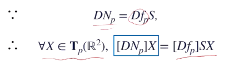
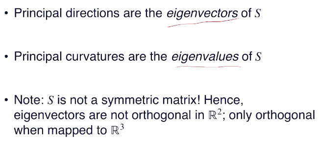
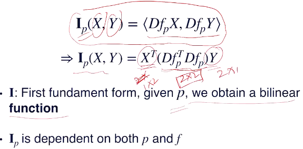
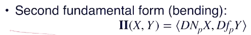

### L2: surface

#### curvature

* 此时有正有负
* 回忆：曲线基本定理
* 定义：法向量的变化情况
* 法向量的定义：就是切平面的单位**（？）**法向量（用两个切向量的基叉乘，然后归一化）
* 法向量模长为1，于是得到N和N的微分垂直
* N的微分:$DN_p=[\partial N/\partial u,\partial N/\partial v]$,即U中一个微元位移可以改变多少N
* 类比的话，必须要求“T长为1”
  * 于是要求对参数空间以T的模长为系数缩放（此时参数空间的一个微元位移已经选好，下同）
  * 于是对应的DN也要除这个系数（缩放后）
  * 除完后的**向量**（$\in \mathbb{R^3}$）就是curvature
  * 显然，这个curvature在不同方向上的值（不同方向上的投影长）不同
  * curvature方向和DN相同
* 因此要在定义一个不变量DIrectional Normal Curvature：$K_n(X)=<T,k>$
  * 是curvature在切向的投影
  * 是一个数值
  * 意义：T和N张成平面在该点和曲面得到的交曲线（二维的！）的曲率
  * 这个才是常用的值
* Geodesic curvature：$K_g$，是curvature矢量在N×T（也在切平面里面）方向的分量
  * 含义：微元位移映射到曲面上得到曲线，再投影到切平面上得到的二维曲线的曲率，反映了参数化的扭曲
* **curvature在N方向是否有投影？**

#### Principle Culvatures

* 改变位移微元，得到不同的DNC
* 最大的DNC、最小的DNC就是Principle Culvatures（记为$\kappa_1,\kappa_2$）
* 此时可能有负数了
* **可以证明二者对应的切向量（Priciple Directions）一定是垂直的（？）**

> 证明可以利用Weingarten映射的对称性。参考：
>
> https://zhuanlan.zhihu.com/p/149536723
>
> https://www.zhihu.com/question/303605875
>
> https://www.math.ucla.edu/~archristian/teaching/120a-w18/week-10.pdf

* 欧拉公式：

### L3 surface：2

* shape operator
  * DN(X)和T（即Df(X))）都在切平面中，但未必共线（考虑参数在B方向上“扭动”的情况）
  * 因此DN和Df的range都是切平面，各自的两个列都是基
  * 因此存在2*2的S变换（shape operator）(作用于Df的domain即参数空间U中)：

    
  * S和X无关
  * 不作证明地给出：

    
  * **如何映射到R^3?**
* first fundamental form
  * curvature completely determines local geometry
  * curvature cannot determine global geometry

    * 关键原因：在曲率为0的方向无法刻画拉伸的情况（与度量相关）
    * 于是需要定义内积
  * form = bilinear func

    
  * 用途：链式法则得到曲面上曲线弧长就是对第一标准形开方积分
* local isometric surface
  * 目标：衡量相似性
  * 假设对同一参数定义域U有两个不同参数化表示生成两个不同曲面，但二者在任意点上的第一标准形相同（**保距变换**），则称local isometric（局部等距）
  * 当然，保“内积”了也就保角了（不过显然保角未必保距）
  * 注意，保的是弧长，不是测地距离（geodesic distance即连接两点的弧的长度的最小值）（真正的isometric应该是保测地距离，因此这里有个local）
  * 用途：例如无论人做什么动作，其表面的第一标准形都是一样的，和姿态无关（当然并不实用，早期可以用的是distance distribution descriptor，即随机取点对看测地距离的分布的相似度）
  * 缺失了弯曲的信息，因此不能完全确定曲面
  * intrinsic就是指geodensic
* second fundamental form
  * DNC（NC）就是二标除一标（带入相同的位移微元）
* fundamental thm
  * 光滑曲面由一标和二标完全确定，且不受刚体运动的影响
* 注解：一标一定是对称阵，二标则未必，因此似乎有7个自由度；然而实际上只有6个，欠缺的一个约束是Gauss-Codazzi条件。因此不是所有的2\*2对称阵和一个2\*2矩阵一配对都能当上某个曲面的一标和二标
* Gaussian Curvature：K
  * 两个主曲率相乘
  * 其符号反映了弯曲方向是否一致
  * **和参数化方法无关（？）**
  * K=0：developable，即可以从平面做保距变换得到的曲面
  * **保距变换下不变，因此其实不反映bending的强度**
  * 实际K非常noisy，因为当有一个主曲率接近0时其相对误差很大，即病态，不稳定
* Mean Curvature：H
