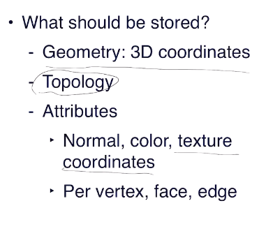
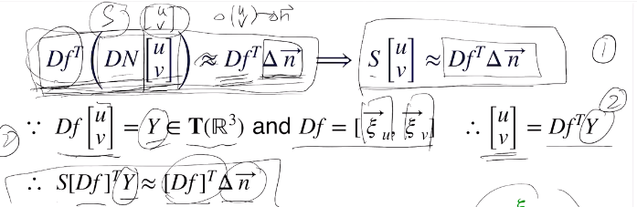
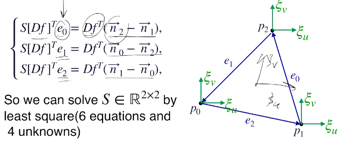
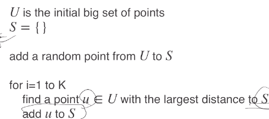

### L4: Mesh, Point cloud

* shape representation
* 表示方式

  * 参数化表示（前面讲的解析式）
  * 数字化的方法：
    * rasterized form（规整的栅格化，对空间进行切分，像素图也是这种东西）
      * 易于存储，运算
      * 精度不够高的话误差也会高
    * geometric form（定义一个函数空间，不规则）
      * 点云
      * mesh

#### Mesh

* polygonal mesh

  * piece-wise linear surface reprensentation
  * 最常见：三角剖分
* triangle mesh

  * V（顶点集）$\in \mathbb{R}^3$
  * E（点之间的连接关系）$\in V \times V$
  * F（哪些三元点组能形成三角形）$\in V\times V\times V$
  * 离散空间的流形条件
* manifold mesh condition

  * 每条边最多处于两个面中
  * 每个顶点的邻节点要形成“扇形”（fan）（参考ppt图）
  * *注：其实多数实际的mesh不是manifold mesh，但有时可以看成是triangle soup，即多个manifold的组合。需要小心处理*
* nonuniform mesh：三角形形状差异很大，面积方差也很大

  * 原理：一般在计算某点几何值（曲率等）时要用插值，因此如果某个三角形超大则误差（与步长相关）也会超大
  * 至于均匀性则和其他一些定理相关……
  * 解决：有现成软件能够对mesh质量进行优化（如meshlab）
* mesh storage

  * 
  * CAD中：STL：一堆点，每三个组成一个三角形，不考虑点的冗余
  * OBJ，OFF等：顶点表存点，三角表记录点index存三角形；常常还会存法向量和纹理信息
    * 通常遵循右手定则定义三角表中存点的顺序，从而便于计算法向量
    * 但有时曲面是不可定向的（莫比乌斯环等），于是无法定义一个consistant的法向（但实用中遇到的少，实际中一般是mesh质量不佳导致的无法得到合适法向）
  * 一般实际采集数据都是点云，但是mesh方便可视化（加纹理，阴影）和计算法向量，mesh也会灵活一些
* culvature：Rusinkiewicz's method

  * 挑战：mesh是平面，但是曲率是二阶量
  * Assume: 在每个triangle中
    * 有一个局部的参数化映射f和对应的参数域定义域U能够映射出这个三角区
    * 三个顶点的切平面相互近似平行（但法向量还是不同——这个差异才是计算的关键）
    * 还存在f能满足：参数域中u，v轴垂直的同时，f关于u，v分别求偏导得到的切向量也相互垂直（然后切向量要归一化，记为$\xi_u,\xi_v$，于是一标是二阶单位阵）
    * 于是，有S就能得到曲率了
    * 
    * 结论刻画了切向量和该方向移动后切向量变化之间的关系，其实就是S的一个定义
    * 然后利用节点的法向量信息算delta n（每片mesh周围的信息就是通过normal考虑进来的），联立出式子（其中Df在实际实用中只要求u，v正交，不再要求偏导切向量正交）
    * 
    * 只要有了每个点的normal即可使用，于是点云里面也能用；非流形也可以用
    * 想要增加robustness：可以多个mesh提供过定的方程组解一个最优值（如同Lucas-Kanade法中求取光流的过程）

#### Pt cloud

* 获取：三维扫描
  * 误差
  * 视角
  * Laser（激光雷达）/radar（一般雷达，清晰度低于激光）（根据时间测距（tof），LIDAR等）
    * 功率够大，场景可以很大
    * 采点稀疏
  * Infrared（红外，kinect等）
    * 常用于室内
    * tof或相位等
  * stereo（多视角几何重构，SLAM等）
    * 精度很高
    * 配准（registeration）困难
  * 共性问题
    * 清晰度（通常指距离远之后采样点变稀疏）
    * 遮挡、自遮挡
    * 噪声
    * 配准（注意：非stereo也需要配准）
* 获取方法2：从mesh采样获取点云
  * 好处：好理解、好存（对大规模数据很好）、便于设计算法
    * surfel：点云，每个点还带上法向量信息（要有法向量信息才好做渲染等）
  * 采样方法：
    * 分目标：
      * 单纯只是为了便于存储/搞算法：则尽可能保存多的细节
      * 为了生成数据集：则尽可能让采样数据和实际数据的情况更相符。
    * 尽可能保存细节：
      * uniform sampling

        * 估计总面积--看每个mesh面片占比，得到各个surface中各须采多少点--采样
        * 问题：其实还是不太均匀（随机性使得有些点会靠得很近，等等）
      * farthest point sampling（FPS）

        * 最大化点距离
        * 严格解：NP-hard
        * 迭代近似

          * 先uniform sampling，但点数远多于目标点数（如采10倍的量）
          * 
          * *（注：点到集合S的距离定义为点到S中所有点距离的最小值。即迭代过程是找maxmin）*
        * **注意！这里算法中所述的“距离”均指欧氏距离**
        * 实现的时候注意方法：应该保存U-S中每个点到S的距离，每向S中加一点就更新一次，设U共有N个点，则复杂度为$O(\sum_{i=1}^K(N-i))))=O(NK)$

          > The Farthest Point Strategy for Progressive Image Sampling
          >
        *
