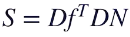
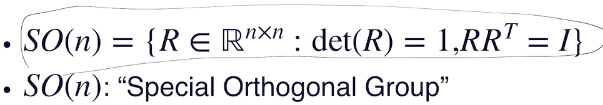

### L4: Mesh, Point cloud

* shape representation
* 表示方式

  * 参数化表示（前面讲的解析式）
  * 数字化的方法：
    * rasterized form（规整的栅格化，对空间进行切分，像素图也是这种东西）
      * 易于存储，运算
      * 精度不够高的话误差也会高
    * geometric form（定义一个函数空间，不规则）
      * 点云
      * mesh

#### Mesh

* polygonal mesh

  * piece-wise linear surface reprensentation
  * 最常见：三角剖分
* triangle mesh

  * V（顶点集）$\in \mathbb{R}^3$
  * E（点之间的连接关系）$\in V \times V$
  * F（哪些三元点组能形成三角形）$\in V\times V\times V$
  * 离散空间的流形条件
* manifold mesh condition

  * 每条边最多处于两个面中
  * 每个顶点的邻节点要形成“扇形”（fan）（参考ppt图）
  * *注：其实多数实际的mesh不是manifold mesh，但有时可以看成是triangle soup，即多个manifold的组合。需要小心处理*
* nonuniform mesh：三角形形状差异很大，面积方差也很大

  * 原理：一般在计算某点几何值（曲率等）时要用插值，因此如果某个三角形超大则误差（与步长相关）也会超大
  * 至于均匀性则和其他一些定理相关……
  * 解决：有现成软件能够对mesh质量进行优化（如meshlab）
* mesh storage

  * 
  * CAD中：STL：一堆点，每三个组成一个三角形，不考虑点的冗余
  * OBJ，OFF等：顶点表存点，三角表记录点index存三角形；常常还会存法向量和纹理信息
    * 通常遵循右手定则定义三角表中存点的顺序，从而便于计算法向量
    * 但有时曲面是不可定向的（莫比乌斯环等），于是无法定义一个consistant的法向（但实用中遇到的少，实际中一般是mesh质量不佳导致的无法得到合适法向）
  * 一般实际采集数据都是点云，但是mesh方便可视化（加纹理，阴影）和计算法向量，mesh也会灵活一些
* culvature：Rusinkiewicz's method

  * 挑战：mesh是平面，但是曲率是二阶量
  * Assume: 在每个triangle中
    * 有一个局部的参数化映射f和对应的参数域定义域U能够映射出这个三角区
    * 三个顶点的切平面相互近似平行（但法向量还是不同——这个差异才是计算的关键）
    * 还存在f能满足：参数域中u，v轴垂直的同时，f关于u，v分别求偏导得到的切向量也相互垂直（然后切向量要归一化，记为$\xi_u,\xi_v$，于是一标是二阶单位阵）
    * 于是，有S就能得到曲率了
    * 
    * 结论刻画了切向量和该方向移动后切向量变化之间的关系，其实就是S的一个定义
    * 然后利用节点的法向量信息算delta n（每片mesh周围的信息就是通过normal考虑进来的），联立出式子（其中Df在实际实用中只要求u，v正交，不再要求偏导切向量正交）
    * 
    * 只要有了每个点的normal即可使用，于是点云里面也能用；非流形也可以用
    * 想要增加robustness：可以多个mesh提供过定的方程组解一个最优值（如同Lucas-Kanade法中求取光流的过程）

#### Pt cloud

* 获取：三维扫描
  * 误差
  * 视角
  * Laser（激光雷达）/radar（一般雷达，清晰度低于激光）（根据时间测距（tof），LIDAR等）
    * 功率够大，场景可以很大
    * 采点稀疏
  * Infrared（红外，kinect等）
    * 常用于室内
    * tof或相位等
  * stereo（多视角几何重构，SLAM等）
    * 精度很高
    * 配准（registeration）困难
  * 共性问题
    * 清晰度（通常指距离远之后采样点变稀疏）
    * 遮挡、自遮挡
    * 噪声
    * 配准（注意：非stereo也需要配准）
* 获取方法2：从mesh采样获取点云
  * 好处：好理解、好存（对大规模数据很好）、便于设计算法
    * surfel：点云，每个点还带上法向量信息（要有法向量信息才好做渲染等）
  * 采样方法：
    * 分目标：
      * 单纯只是为了便于存储/搞算法：则尽可能保存多的细节
      * 为了生成数据集：则尽可能让采样数据和实际数据的情况更相符。
    * 尽可能保存细节：
      * uniform sampling

        * 估计总面积--看每个mesh面片占比，得到各个surface中各须采多少点--采样
        * 问题：其实还是不太均匀（随机性使得有些点会靠得很近，等等）
      * farthest point sampling（FPS）

        * 最大化点距离
        * 严格解：NP-hard
        * 迭代近似

          * 先uniform sampling，但点数远多于目标点数（如采10倍的量）
          * 
          * *（注：点到集合S的距离定义为点到S中所有点距离的最小值。即迭代过程是找maxmin）*
        * **注意！这里算法中所述的“距离”均指欧氏距离**
        * 实现的时候注意方法：应该保存U-S中每个点到S的距离，每向S中加一点就更新一次，设U共有N个点，则复杂度为$O(\sum_{i=1}^K(N-i))))=O(NK)$

          > The Farthest Point Strategy for Progressive Image Sampling
          >
        * 优化：多进程
      * Voxel Downsampling：从高分辨率点云到低分辨率点云

        * 将空间栅格化，每个空间小格取一个点
        * 实现：hash（除之后取整分桶），则O(N)
        * 问题：artifacts大
        * *或许可以用到一些频谱分析和模的理论*
    * 基于应用的采样
      * 常常出现的情况：训练结果其实反映的是sampling的情况（尤其是生成时）
* estimating normals
  * plane fitting：认为目标点附近的点都在同一平面中，从而求一个近似的法向量——变成一个带约束（N模长为1）问题——KKT搞定
  * 结论：w是绝对值最小的奇异值对应的基向量
  * 另外两个基向量其实就是两个切向量（理由：考虑PCA，奇异值绝对值大小反映此方向方差的大小，则此结论显然）
  * neighborhood怎么取比较tricky
  * RANSAC可以用于优化质量
  * > **Random sample consensus** ( **RANSAC** ) is an [iterative method](https://en.wikipedia.org/wiki/Iterative_method "Iterative method") to estimate parameters of a mathematical model from a set of observed data that contains [outliers](https://en.wikipedia.org/wiki/Outliers "Outliers")——wiki
    > 是非确定性方法：以下为一次迭代
    > 1.Select a random subset of the original data. Call this subset the hypothetical inliers.
    > 2.A model is fitted to the set of hypothetical inliers.
    > 3.All other data are then tested against the fitted model. Those points that fit the estimated model well, according to some model-specific loss function, are considered as part of the consensus set.
    > 4.The estimated model is reasonably good if sufficiently many points have been classified as part of the consensus set.
    > 5.Afterwards, the model may be improved by reestimating it using all members of the consensus set.
    >

### L5 3D transformation

* 表现物体之间关系：带方向的bounding box，评价不同物体间的位姿
* 拓扑
  * 

#### SO3（R3中的旋转，3个自由度）

* 反应的是坐标系之间的变换
* SO2（R2中的旋转，1个自由度）和圆的边是拓扑等价
* ~~SO3和球面拓扑等价~~（错）
* Consider the solid ball in $\mathbb {R} ^{3}$ of radius **π** (that is, all points of $\mathbb {R} ^{3}$ of distance **π** or less from the origin). Given the above, for every point in this ball there is a rotation, with axis through the point and the origin, and rotation angle equal to the distance of the point from the origin.The identity rotation corresponds to the point at the center of the ball——wiki
* 注意：这里还需要把球面上每对极点都“粘”在一起（商），因此**这并不是说三维球体和旋转同胚！！！！！！！！！！！**
* 
* det=-1则附加上反射对称
* 关注topology的理由:一般神经网络参数化后的输出范围是一个cubic之类的东西，因此不可能找到一个可微双射将其转化为SO2旋转
* 重要的是可微！否则相邻两点的预测结果可能差异很大（是否是双射可能尚存讨论余地？）
* 再者是期望参数化前后的“变化速度”基本成比例（旋转幅度小/大时也期待参数化输出的距离小/大），即：

#### rotation的representation

* 欧拉角：用得少，分轴转，不唯一，还有万向锁（**Gimbal lock**）问题（相当于某些位置下会莫名丢失自由度，会导致导数有些问题）
  * Gimbal lock：比如y方向转90°，则x和z无论怎么转都只在一个平面里面旋转，因此丢失了一个自由度（油管上一堆演示视频）
  * 对于梯度的影响：参考https://www.quora.com/Robotics-What-is-meant-by-kinematic-singularity?share=1；实际上，发生lock的实质就是这个位置上旋转的Jacobian不满秩（所谓的“切向量降维”），也就是说梯度下降的轨迹也会限定在一个唯一的方向，不能覆盖整个参数空间
* Axis angle：用一个轴（模长为1，自由度为2）和对应的转角（自由度为1）
  * 等价的描述：用转角数乘单位长的转轴得到所谓“rotation vector”（按：即3D rotation和球体拓扑等价的理由）
  * 可以用反对称算子的矩阵乘积代替对应的叉积
  * 3D旋转李代数：所有3*3反对称矩阵（小写so3）
  * 最后通过解矩阵ODE得到Axis angle对应的旋转矩阵。如下所示：
  * 
  * 注意Rodrigues Formula（https://mathworld.wolfram.com/RodriguesRotationFormula.html） 则指数求和是有限项：
  * 上面的第一式既可以直接计算验证，也可以更优美地计算其特征多项式然后用Cayley-Hamilton一步导出（参考：https://lcvmwww.epfl.ch/teaching/modelling_dna/index.php?dir=exercises&file=corr02.pdf）
  * 第二式就是Rodrigues Formula，即如何通过旋转矢量求旋转矩阵（证明直接taylor配一下）
  * 注意，同样不唯一（$(\hat{\omega},\theta),(-\hat{\omega},-\theta)$），因此反过来求时需要限定一下$\theta$的取值范围在0~pi内
  * 
  * 好处：旋转之间的distance（定义为转角，不考虑轴）可以很好地表现出来（见ppt）
  * 实际使用：直接使用rotation vector三元组，但模长限定在0~pi。问题：在theta=pi时不连续（axis可能可以反复反向），所以不宜直接使用。
* Quaternion（四元数）
  * 
  * 
  * 单位长的四元数就可以和旋转一一对应（即认为旋转和一个四位超球面拓扑等价）
  * 但实际操作（见下）中四元数不用管是否单位长，即使不是也会被逆消去模长
  * 
  * 显然，旋转的合成就是四元数的积
  * 四元数和axis angle转化较易：
  * 
  * 四元数转化为矩阵：有闭式解；反之则最好通过axis angle间接转化
  * double-covering：每个旋转对应两个互为相反数的四元数（这里是假定只考虑单位四元数，其实整条线上的四元数都是相同的旋转）
  * 四元数也需要归一化，可能会造成一些问题
  * 注意不同的库实部可能在前或在后
  * 最流行
  * 
  * **参考：On the continuity of rotation representations in NN**
    * 主要观点：三维、四维的旋转表示都不处处连续，但5或6维有。NN对连续函数的回归效果通常更好
    * “连续”指参数化（由旋转空间到参数空间）映射连续
    * 参考real projective space（RP^n），指把R^n原点扣掉后关于过原点直线作商，RP^3和SO3是微分同胚（前面说的奇怪的球体也和他们是微分同胚）
    * 根据嵌入理论可知没有低于5维的微分同胚（参考：https://math.stackexchange.com/questions/3918173/emedding-of-mathbb-rp3）
    * 对于SO3，一个微分同胚是直接取旋转矩阵的其中两列（第三列用前两列叉积得到）
    * 结果而言，6D略高于5D，远高于其他参数化方法。

过去曾经流形先粗粒度离散地按分类方式搞一次估计，然后微调。这样可以避免不少参数化问题。但是现在的参数化方法已经能做到很好了。然而粗粒度离散地分类可以给出一个可信度的信息。
