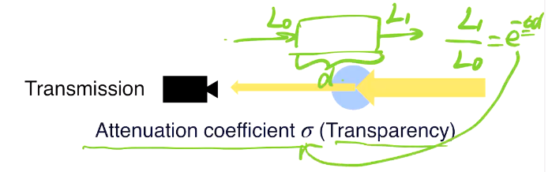
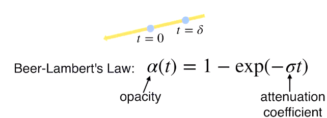
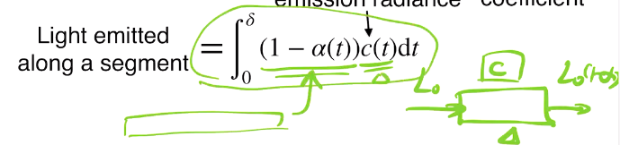
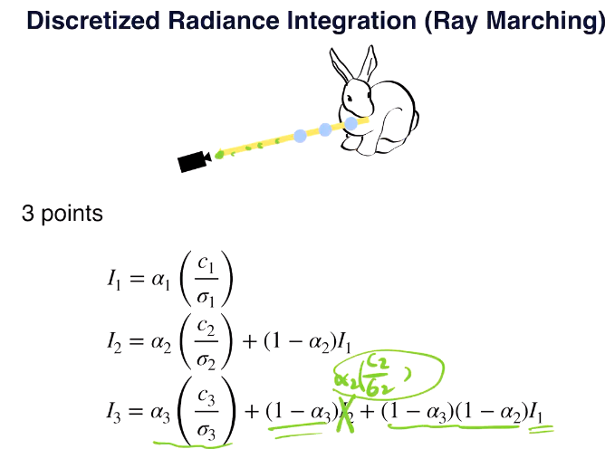
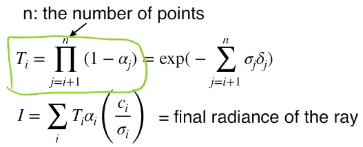

以下：开始搞更实际的问题：

### L6 基于学习的多视觉（MVS）重建

MVS：通过不同平面图像重建3D（假设相机内外参已知）

* Triangulation
  * 对每一个像素，单张相片只能确定其空间位置在一条从相机出发的线上
  * 两张或多张相片交点即可确定点
  * 问题：如何在多张图片中找到相关的点（同一个点），如何处理直线交不到一起的情况（可以用优化方法）
  * 一种优化方法：一张相片得到的线投影到另一张相片中就成为寻找相关位置的约束
  * 开放性问题
  * 传统多目视觉：已有成熟库（colmap等）
  * 问题：
    * 无纹理情况，可能需要全局信息
    * 反射等特殊情况
    * 纹理重复率高，不好找相关
* learning方法
  * 用learning feature或shape prior
  * Deep Columetric Stereos
    * source view：可以获取照片的角度；reference view：希望预测深度图信息的角度（有了深度图信息后可以通过几何方式得到对应pixel的颜色信息，但本质上DCS只给深度图信息不给外观信息！！！）
    * 只估计reference view视锥中的深度信息
    * 把视锥（似乎要切去深度过小的一部分）在相平面上均匀切分，在深度方向按1/d均匀切分，即可扭转为一个规则的三维立方体
    * 
    * image feature warping：对每一个source view上的相片先卷积一下，每个pixel都提取出k维特征，然后对每个voxel，将其与各个source view相连，取出和成像平面交点处的K维特征。设有N个source view，则每个voxel上有KN维特征
    * 在视锥中做三维卷积，预测每个voxel是表面的概率
    * 最后“积分”得到深度的期望值
    * 
    * 为什么用这种“积分”（求期望）的方式（而非max）？对半透明材质而言这样更准
    * 限制：相片角度相差不能过大，尽量不要使得出现reference view射出射线穿过两个“表面”的情形（在没有这种情况时，DCS效果还是可以的）
    * 工程上当reference view的voxel与source view的连线在source得到的相片之外？则填充UNK之类
    * loss：在reference view的**有效pixel**（？）上看深度的一阶范数
    * 问题：
      * quality/speed取舍
      * 当深度有突变边缘（前景/后景）时，在边界预测出的概率可能出现两个峰值（即类似前面说的出现两个表面），然后期望结果可能就是均值（artifact）（一种方法是，先算出边界，然后特殊处理）
  * 改进
    * adaptive space sampling（Coarse to fine）
      * 在可能出现边界的深度上分细一些，其余地方分粗一些
      * 先做粗粒度的估算，在根据估算结果确定哪些地方细分，那些地方粗分
      * eg.Cascaded Depth Prediction：上面的这种过程可以重复多次。注意到不同分辨率的估算需要不同分辨率的输入特征，因此用多层特征提取器（见下）
      * 
      * 潜在问题：不同射线上深度划分不同，需要用更特殊的卷积方式（稀疏卷积，参考https://zhuanlan.zhihu.com/p/382365889）/扭曲成平直规则的形状（推测前者更为常用）
  * Point-based
    * 先DCS，搞个粗粒度深度图，深度图可以直接换算成粗粒度点云，然后在这个点云的基础上再Coarse to fine
    * to fine的方法是：沿着对应点和相机的连线移动，使得点更接近真实表面。每个点移动的向量构成一个Flow
    * FLow的计算方法是：在每条射线的点的前后再加数个假设点，然后预测所有点的可能的权重，最后把非假设点（原来就有的点）邻域内的所有点相对于此非假设点的位移加权得到期望的offset（这个做法可能未必非常合理）
  * depth-normal consistency loss（更好的loss设计）
    * 只预测深度图：可能整体不太平坦，且深度突变时会平滑
    * 方法：让法向量指向尽可能（和真实的法向量）一致，不要老是变来变去的
    * 另一个重要原因：法向量只需要局部信息，是比深度更好估计的量（即至少不会变得更差）
    * 用深度图也可以算一个法向量，则二者比较即可得损失
    * 一种naive的方法是loss中加一项关于normal的项
    * 另一种：用一点的预测深度+此点的normal可以得到邻近点的深度估计值，这个估计值应该和邻近点的预测深度相近。这个loss一般只会backward到depth网络，而截断与normal model的连接（因为normal的预测认为很准）
    * 其实Normal的积分也是depth（差一个常数）（参考https://stackoverflow.com/questions/52414351/calculating-depth-image-from-surface-normal-images-confused-about-integration-s）。但实际中depth一般不连续，在边缘突变，因此不用这种方法求depth
* Appearance info capturing（NERF）
  * 在相机射出射线上的appearance被捕捉到
  * 定义light transport model即可得到对应pixel的color
  * 以上color和ground-truth对比得到loss
  * Volumetric light transport model：

    * 透射：吸收/散射一部分光后光线变弱
      * 衰减系数$\sigma$：
      * 
      * 不透明度$\alpha$
      * 
    * 散射光进入此点后可以出射，光线变强；本身可能也是光源发光，光线变强
      * 散射强度（以上两个因素一同考虑）c，代表单位长度光线增强的量，则任意一段segment因散射而能增强的光强为积分式（假设每个长度微元上衰减系数和散射强度近似为定值，则这一点显然成立）
      * 
    * 通常认为c就是定值，则积出来是

    $$
    c\alpha_{\delta}/\sigma
    $$

    * 但是线段太长则c不能被认为是定值，因此分为若干段，逐段递推即可得到相机处的光强（注意上面的积分只是本段增强的光强！）
    * 
    * 这就是所谓ray matching，递推结果为
    * 
    * 通常$c_i$和$\sigma_i$都很小，因此一般预测的是$\sigma_i,c_i/\sigma$
    * Nerf:用net估计各个voxel的以上两个参数，然后ray matching可以渲染出图像。
    * 也有人在考虑动态场景，因为光源常常在变化位置，如果不考虑时间则不同光源的nerf就得重训一次

### L7 single image to 3D

* 病态的，信息不全
* 因此必须强调prior是什么，因此DNN对此较好
* 数据集：
  * 采集真实data，贵
  * 合成数据（Synthesis for learning，其实是非常general的思路），三维模型库——图片渲染——image-shape pair（早期极为常用，现在依然再用），问题在于存在sim-real domain gap
    * 有一种缩小gap的方式是为渲染的图片添加背景（从图片数据库搞），——domain-randomization
    * 相机内参处理：在randomization时就使用多种不同的内参设定来渲染2D图像，这样可以获得更generalize的model，并且实际效果也很不错
  * 3D库一般是mesh，一般认为模型预测点云比直接预测mesh更容易，因此往往需要先用FPS等搞到点云
  * shapenet就是一个很好的3D数据集
* to depth map：直接卷积，可以类前使用normal信息，其实不好做（depth到点云质量差，且深度突变处有artifacts）
  * 重要原因：2D中接近的点在3D中完全可以不接近；直接预测3D则邻近点就真的在3D中接近
  * 另外，以下的直接预测点云的方法不要求点和图片中二维点的对应，能够缓解边界上的问题
* to point cloud
  * 另一个好处：容易通过残缺的（可见部分）point cloud恢复整体3D形状
  * 而且点的数量不需要特别多（几k就很够），且易于调整
  * 图片——model——N乘3矩阵，loss设在N乘3矩阵之间
  * loss用于比较两个集合之间的差异
* to mesh：需要拓扑结构，更困难
* to implicit field function（SDF，对拓扑的要求更弱）
