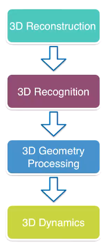
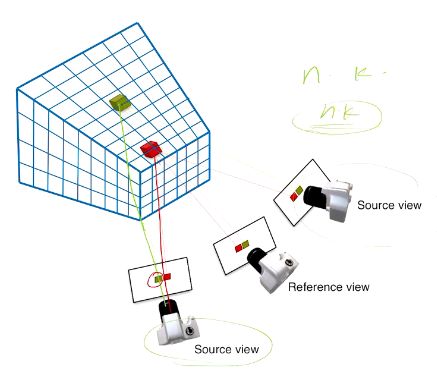
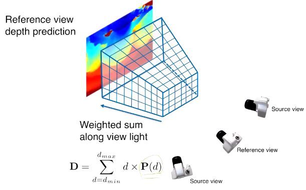
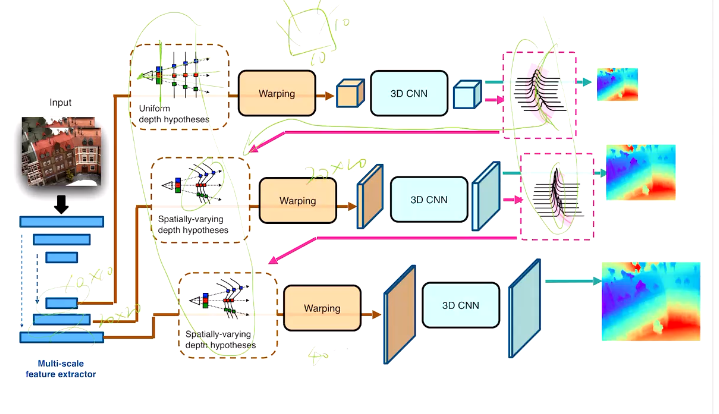

以下：开始搞更实际的问题：

### L6 基于学习的多视觉（MVS）重建

MVS：通过不同平面图像重建3D（假设相机内外参已知）

* Triangulation
  * 对每一个像素，单张相片只能确定其空间位置在一条从相机出发的线上
  * 两张或多张相片交点即可确定点
  * 问题：如何在多张图片中找到相关的点（同一个点），如何处理直线交不到一起的情况（可以用优化方法）
  * 一种优化方法：一张相片得到的线投影到另一张相片中就成为寻找相关位置的约束
  * 开放性问题
  * 传统多目视觉：已有成熟库（colmap等）
  * 问题：
    * 无纹理情况，可能需要全局信息
    * 反射等特殊情况
    * 纹理重复率高，不好找相关
* learning方法
  * 用learning feature或shape prior
  * Deep Columetric Stereos
    * source view：可以获取照片的角度；reference view：希望预测深度图信息的角度（有了深度图信息后可以通过几何方式得到对应pixel的颜色信息，但本质上DCS只给深度图信息不给外观信息！！！）
    * 只估计reference view视锥中的深度信息
    * 把视锥（似乎要切去深度过小的一部分）在相平面上均匀切分，在深度方向按1/d均匀切分，即可扭转为一个规则的三维立方体
    * 
    * image feature warping：对每一个source view上的相片先卷积一下，每个pixel都提取出k维特征，然后对每个voxel，将其与各个source view相连，取出和成像平面交点处的K维特征。设有N个source view，则每个voxel上有KN维特征
    * 在视锥中做三维卷积，预测每个voxel是表面的概率
    * 最后“积分”得到深度的期望值
    * 
    * 为什么用这种“积分”（求期望）的方式（而非max）？对半透明材质而言这样更准
    * 限制：相片角度相差不能过大，尽量不要使得出现reference view射出射线穿过两个“表面”的情形（在没有这种情况时，DCS效果还是可以的）
    * 工程上当reference view的voxel与source view的连线在source得到的相片之外？则填充UNK之类
    * loss：在reference view的**有效pixel**（？）上看深度的一阶范数
    * 问题：
      * quality/speed取舍
      * 当深度有突变边缘（前景/后景）时，在边界预测出的概率可能出现两个峰值（即类似前面说的出现两个表面），然后期望结果可能就是均值（artifact）（一种方法是，先算出边界，然后特殊处理）
  * 改进
    * adaptive space sampling（Coarse to fine）
      * 在可能出现边界的深度上分细一些，其余地方分粗一些
      * 先做粗粒度的估算，在根据估算结果确定哪些地方细分，那些地方粗分
      * eg.Cascaded Depth Prediction：上面的这种过程可以重复多次。注意到不同分辨率的估算需要不同分辨率的输入特征，因此用多层特征提取器（见下）
      * 
      * 潜在问题：不同射线上深度划分不同，需要用更特殊的卷积方式（稀疏卷积，参考https://zhuanlan.zhihu.com/p/382365889）/扭曲成平直规则的形状（推测前者更为常用）
  * Point-based
    * 先DCS，搞个粗粒度深度图，深度图可以直接换算成粗粒度点云，然后在这个点云的基础上再Coarse to fine
    * to fine的方法是：沿着对应点和相机的连线移动，使得点更接近真实表面。每个点移动的向量构成一个Flow
    * FLow的计算方法是：在每条射线的点的前后再加数个假设点，然后预测所有点的可能的权重，最后把非假设点（原来就有的点）邻域内的所有点相对于此非假设点的位移加权得到期望的offset（这个做法可能未必非常合理）
  * depth-normal consistency loss（更好的loss设计）
    * 只预测深度图：可能整体不太平坦，且深度突变时会平滑
    * 方法：让法向量指向尽可能（和真实的法向量）一致，不要老是变来变去的
    * 另一个重要原因：法向量只需要局部信息，是比深度更好估计的量（即至少不会变得更差）
    * 用深度图也可以算一个法向量，则二者比较即可得损失
    * 一种naive的方法是loss中加一项关于normal的项
    * 另一种：用一点的预测深度+此点的normal可以得到邻近点的深度估计值，这个估计值应该和邻近点的预测深度相近。这个loss一般只会backward到depth网络，而截断与normal model的连接（因为normal的预测认为很准）
    * 其实Normal的积分也是depth（差一个常数）（参考https://stackoverflow.com/questions/52414351/calculating-depth-image-from-surface-normal-images-confused-about-integration-s）。但实际中depth一般不连续，在边缘突变，因此不用这种方法求depth
