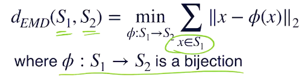
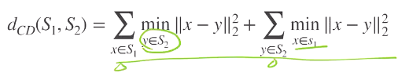
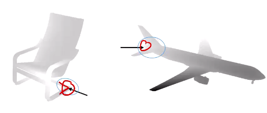
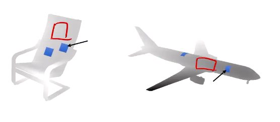
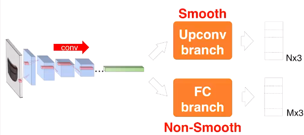
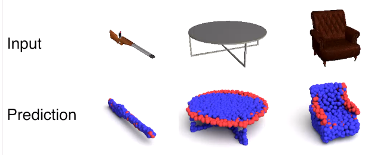
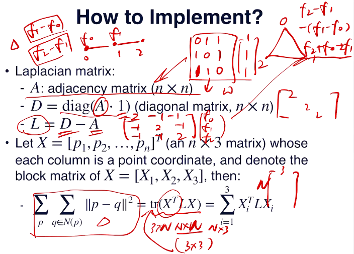

(续上次single image)

* loss
  * 比较两个集合的差异性（应当抛弃顺序信息，即对交换顺序有不变性）
  * 有两种常用的：
  * EMD loss（Earth Mover's DIstance）
    * 即推土机距离，衡量的是分布之间的相似度（如何搬土使得需要搬的量最小）
    * 在点云上的定义：需要找到一个匹配双射，使得距离和最小
    * 
    * 此loss连续（在correspondence变化处由于是求min，则连续，但是是一个尖点）但不可微
    * 好消息：以上所述尖点其实合起来是0测集，因此（类似Relu一样）对优化的影响没这么大。在这个零测集以外的部分处处可微
    * 问题：点数必须相同；计算量较大（需要做近似+cuda）
  * CD loss(Chamfer Distance)
    * 用得更多，主要原因计算更简单（实用效果上没有观察到明确的区别）
    * 
    * 即对称地找最近邻距离（如果只有一项，则可能出现一个点特别远但没有点与其“匹配”）
    * 连续、可微性同EMD loss
  * 对比：
    * ambiguity（人也很难识别），例如椅子可能有两种朝向，则最终可能会预测出一个平均朝向。loss影响的就是这个mean shape
    * 但是没有更严格的对比
    * 通俗理解：EMD希望给出的是一种样本的分布意义上的平均，而CD给出的是对所有样本铺在一起然后最小化L2 loss得到的东西。在一些toy model中EMD容易丢失一些细节但是略微平滑（即对连续的hidden variable（如一个半径在不断变化的圆）可能更好），CD有些杂乱fuzzy但是能保留不同样本之间的不同信息（面对discrete hidden variable（如有一个乱动的小方块）可以保存小方块到过的各个位置的信息，但EMD就会平均，从而丢失这些信息）
    * 但是实践中差别不大，而CD算的快因此CD用得多
* network
  * Encoding——FC——reshaping
    * 关于“近邻”的限制较少
    * 看上去简单，实际效果还行
    * 对于一些拐角之类的地方较（conv类方法）好
    * 
  * Conv——deConv（得到相同大小的图像）——reshaping
    * 可以保留近邻的信息
    * 对于偏向于平面的一些重复性结构较好patch
    * 
  * 一种方法：两个网络得到的点云做个并集
  * 
  * 
  * 上图红色就是FC结果，蓝色就是conv结果
  * 又一种理解：其实deconv学习的是一种surface的参数化，参数空间就是deconv输出的大小相同的图像，之后贴纹理时可以利用这个图去贴
  * 还可以刻画不同（但相似的）几何体之间的对应关系

#### image to mesh

* 还需要点与点之间的连接关系，但这个连接关系并不唯一！因此学习这种有歧义的东西可能有点问题
* 第一类：利用中间表示：voxel、SDF、点云（前两者可以用marching cube搞成点云，点云可以用poisson方法搞成mesh）
* 第二类：Editing-based：学习如何把template mesh（如一个球）变形（点平移，连接关系不动）成目标几何体。问题：不同胚时就没法这么变形
  * loss：四类
    * 在顶点上用CD，EMD；但是这样不够，因为有的点可能会折来折去，或者造成mesh的三角形状差别过大，因此单独用是不够的
    * uniform vertices distribution：正则，限制edge不太长：所有edge的边长平方（的两倍，不过无所谓），也可以使得mesh均匀
      * 实现：laplacian matrix
      * 
      * L其实是在以不同顺序求二阶差分，和laplacian operator二阶导是类似的功能，故此得名；X就是N乘3坐标矩阵
    * mesh surface smoothness：针对每个edge定义，每个edge关联的两个面的二面角接近180°
    * normal loss（也有平滑表面的效果）（同前）
  * 改进：不让每个点独立地动，而是设定一些control point（handle），可以产生一些deformation field，维数降低（这个就是最近的工作）
  * 处理拓扑问题：
    * 提供多种/多个template mesh（例如提供多个纸面，然后合成一个大物体）。问题：self-intersections；deformation较为复杂
    * 设法允许打洞：其实很困难（虽然实现了，但是效果很成问题），可以一次打个洞，逐次进行
      * 何时开洞？
      * 洞可能开得太多，产生开放边界过多
      * 复杂形状很难开洞
    * 设法填补？添加topology的loss？
    * 考虑skeleton的方法应该不错
