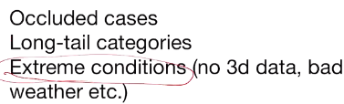

* pointnet这种结构也可以用于其他的集合领域（例如：连拍图片去噪），现在相当流行

#### PointNet++

* 即可以考虑局域特征。方法：在有N个点的点云中抽取N1个点作为所谓seed points（或者称为anchor points），然后把各个anchor半径为r（超参）的邻域中的点全部拿出来过PointNet，从而得到在anchor上的一个特征；
* 这种方法可以分层一直持续使用，从而获得多尺度feature
* r的选择：一般要让邻域中至少有30+个点才行；另外，也不一定非要是球邻域，也可以是KNN，但这要求采样均匀
* 这里，传统的pointnet基本等同于conv
* 尤其对segmentation式的任务很有效：如果采用类似U net的方法（即希望原分辨率上每个点都负有一个高维特征以便于对每个点进行分类，从而完成分割任务），则需要有办法从低分辨率向高分辨率回传特征（即低分辨率得到的特征直接连接到高分辨率邻域中所有点的特征上）。PointNet++提供了这种可能性。——是点云上的baseline
* *注：Unet*：
* 

#### 重要：sampling problem

* 实际数据中：采样通常不均匀，有遮挡
* domain gap（（由仪器等导致的）数据分布差异，在一个分布上学到的model未必在另一个分布上有效）
* 一些方法：
  * 随机drop out部分点（但可能没有办法按照sensor固有的行为模式去dropout一些点）
  * canonicalize pt cloud（如直接转换为表面的表示）
  * 用smooth的kernel卷积
* 第二种方法
  * 相当于每个仪器（每种分布）都需要自己给自己训练一个补全表面的网络，然后不同分布的数据补全后就可以用相同的网络做下游任务
  * 这个补全网络可以用仿真环境和人工数据模拟训练
  * 例如，LiDAR之类就可以先设法根据设备或其采集的数据看他会在空间角的哪些角度上发射激光，据此即可在人造数据集上仿真其采集过程
* 第三种方法
  * 一种实现：KPConv
  * 首先是conv相比pointnet的优越性：pointnet对每个点的模型都是一样的，而conv潜在的可以给空间位置不同的点以不同的权重，因此可能表现能力更强
  * 但是点的位置不均怎么处理？
  * 特别好的办法：用空间上连续的核！我们只指定核的若干seed point上的权重，其余位置的权重由核函数（GMM等）补全，然后加起来
  * 目前是SOTA
  * 只要kernel较为smooth，则稍微变下位置不影响结果
  * 问题：假如有一个特别小的（相对于kernel而言）区域聚集了很多点，则这些点的权重基本相等，可能会导致某几个关联的权重的系数特别大，即同样的表面只是改变了一下sampling的方法，结果就受到较大影响
  * 这个问题可以grid sample（按照grid下采样）解决，但在不宜sample的场景中也不好搞
  * 另一种：Monte Carlo Conv：即除以density

#### 3D detection

* amodel：包含对物体的补全（也有人只对可见部分补全）
* 常用：Waymo Open（这里边对boundingbox朝向做了限制，只能在地平面转动）
* IoU：交集除并集
* AP：average precision
  * 获取了一堆待定box：假如用很多box则一定能框中，但框错的更多；假如只用一个置信度最高的box，则有很多没框住
  * 如何平衡二者（precision——recall）：用PRRoC，即precision-recall曲线下方面积
  * 方法：先取置信度最高的box与其最近的ground truth box联系，看IoU是否超过阈值来判断是否正确
  * 然后precision=正确对数/取过的box数，recall=正确对数/gt box数
  * 然后取置信度第二高的box与其最近且未被联系过的box匹配，……
  * 随着取过box数增加，precision总体下降，recall不断上升，即可得到PR曲线
* mAP：可以对不同类别mean，也可以对不同iou阈值求mean（后者是mAP的一般定义）
* 传统方法：
  * template-based：检测单个物体
  * clustering-based：检测一类物体
  * sliding window-based：最常用，但是计算量大
* deep learning
  * 数据集
  * 2Ddetection
  * 3Ddeep learning
* 仿照FasterRCNN+dense voxel即可（但计算量大）
* 改为稀疏表示：由于物体中心通常不在表面中，因此还需要预测面外的信息，计算量也大/或预测的是一个平移后的box

以下展示三种方法：

* image-driven
  * 利用成熟的2D方法进行估计，例如先2D上搞出一个box，然后估计深度，然后得到3Dbox
  * 如果同时有2D和3D信息（点云/深度图）：先2D搞出box，然后得到视锥，然后在（3D点云的）视锥（frustum）内部获取3D box
    * 视锥中也有其他东西的点云
    * 处理：Frustum PointNets
      * 先预测2Dbox（*注意，不是在2D搞segmentation，因为搞也搞不精准，这还是放到3D里面去做（可以结合到3D深度的信息，使得segmentation更精准），这其实会造成相当大的差别*），搞到bounding box（进而得到视锥中的点）和类别信息（或给出特征向量），这二者传给下一层
      * 过任意一种点云网络，对点做segmentation（每个点判定一个是/否符合类别信息的label）（此时也常常给点的坐标中心化，即平移一下）
      * **注意：此时筛出的点未必完整！因为2Dbox未必精准，如果偏小则视锥外还有点**
      * 但如果只是想看3D boundingbox，则也不用这么准确，只要把对应的点取出来过任何点云网络预测box参数即可（还是要中心化）
      * 当然，也可以像RCNN之类来个3D refinement
    * 这种方法对小物体提升特别大，因为2D照片分辨率高得多
    * 需要做一系列canonicalization
      * 先旋转视锥到固定方向
      * 两次中心化（前述）
      * 估测3D box前还需要用**Tnet**（？）估计一下刚体运动，从而做一下移动再估计box
    * 问题：
      * 依赖于2Dbox，如果由于光照等原因没找到则误
      * 非极大值抑制，则会误判二维上较为邻近的物体（即使三维离得远，这或许提示我们可以把此方法和其他方法结合）
* dimension reduction
  * 类似前面3D变2D，但是是在竖直方向拍平，即（在自动驾驶等环境下）认为物体都是在地平面分布——bird's eye view (bev)
  * 以上问题：效率有点问题，因为远处的点是很稀疏的，使得得到的2D不少地方是空的（*为什么不改为极坐标系等？*）
  * 改进：PointPillars（Pillar：柱子）：只计算非空的pillar，然后把这些pillar映射到二维图像上——目前在无人车上用的最多
  * 这类方法的问题：拍平，因此室内等场景不适用
* leveraging sparsity in 3D（Votenet）
  * 物体中心不在物体表面上
  * 让每个点预测自己所属物体的中心在哪儿
  * Hough voting：在空间中采集少量若干个样本，然后拟合得到一个模型，模型参数在参数空间得到一个点；反复进行，则参数空间会出现一个或几个点聚集的区域，这些地方就是预测结果（对多模态问题也很实用）
  * **random transform**
  * 做法：
    * sample一些seed point，然后对seed做预测中心（预测位移）（这样更高效）和提取特征向量
    * 过vote网络，移动其坐标并进一步处理预测（不同移动方向可能也需要指定不同特征向量）（这里必须单独提供监督信号，不然端到端训练不好办）
    * 聚类（原文是降采样+邻域特征求平均得到K个中心+特征向量）
    * 用网络预测box、类别等（后面会有非极大抑制，则box数少于K）
  * 缺点：对于一些较大的物体，vote得到的“中心”可能较为fuzzy
  * 注：只使用了深度图/点云信息，改进：ImVotenet：2D图上也可以vote一个center，然后转到3D图上（**怎么做？**）
* 未来：
  * 多模态信息
  * 时序信息
  * 和经典机器学习问题的结合
  * robotics
  * 问题：
  * 
