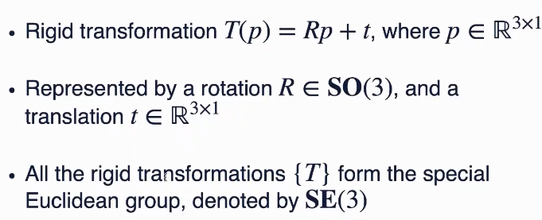

### Instance segmentation

* semantic segmentaion：场景分割，但不区分具体的物体
* instance segmentation：进一步，标注尽可能多的具体的物体
* panotic segmentation：可数物体标注instance，不可数则按semantic分割
* IoU：交除并，用在点云里也可以

Top-down

* generate proposals：bounding box
  * 好的proposal：易于参数化，易于判定内外
  * 一般选box或球
  * 传统：sliding window
  * 和segmentation配套的两种proposal办法：
    * 3D-Bonet
      * 直接对整个场景用任意3Dbackbone提取特征
      * 然后直接按照给定量N吐出N个7维box（6D+置信度1D）
      * box之间的距离：IoU或顶点间距离，据此用匈牙利算法得到最佳匹配（EMD）
      * Soft IoU：拿class prob distribution来近似计算IoU（为了考虑到分类结果是一个分布而非一个绝对的数值），参考https://www.cs.umanitoba.ca/~ywang/papers/isvc16.pdf
      * 问题：box不够精细（例如打开的笔记本上放个手机，则一框全进去了）
    * GSPN
      * 利用生成模型
      * seed pts——seed周围多尺度地取邻域过backbone，得到的特征连在一起——生成shape proposal（一组点云）——为了便于处理和进一步优化，还是转化回box（即使如此，box的效果还是好很多
      * 
      * center pred loss：huber loss
      * shape gen loss：chamfer distance
* associate pts with proposals：对box进行调整，分析前景背景等
  * 
  * BOnet：
  * 
  * 可以用交叉熵算loss

Bottom-up（自底向上聚类，常常效果更好）

* 关键：如何聚类——如何定义metric
  * pointnet得到特征向量的Lp距离
  * spatial feature：直接根据空间位置聚类（也可以结合votenet搞中心），通常边界会有一定问题
  * Instance Features：sample点——网络判定是否在同一个instance中（效果最好）
  * loss：分类
    * 同一个instance：就是Lp距离
    * 不同instance：
    * 即要把不同的点至少拉远到K1距离，类似SVM
* 然后就可以聚类（可以有些微调）
  * DBSCAN
  * Mean shift
  * learning
  * 分层级merge（**可以看看**）：
  * 
* 后处理
  * 只保留高confidence的物体

### L11：6D Pose Estimation（object pose）

rigid transformation

* SE3就是包含平动和转动
* 必然是两个frame之间的比较，这里都假设已经存在一个canonical的frame然后再谈6D pose
* 先旋转，后平移

#### estimation

* 可以有correspondent point然后解方程组
* 需要三个不共线的点对可以唯一确定rigid trans（注意小心虽然两个点就有六个方程，但不独立）

给定对应，求rigid T：least square+约束（正交、行列式=1）

* t可以直接得到闭式解，于是t可以被消掉（即两组点都中心化）
* 于是估计R：orthogonal procrustes problem
* 有闭式解：
* 
* 注：如果解出的R行列式是-1，则随便把某列取负

求对应：ICP

* 两个点接近，则更有可能对应（仅当pose变化小时才成立），不断迭代即可得到一个渐进的估计
