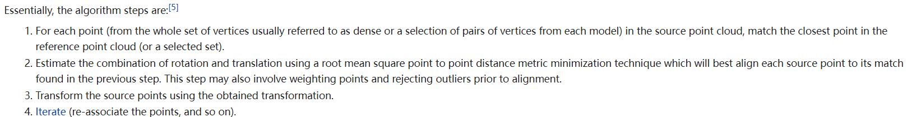
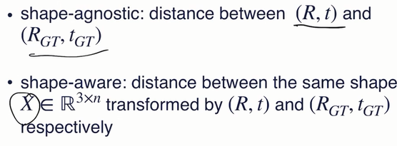
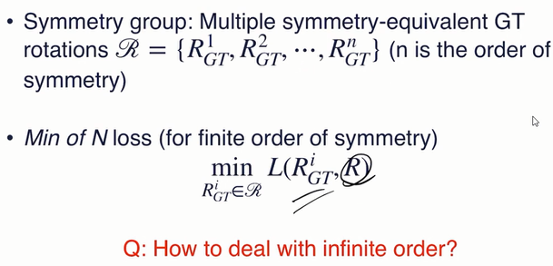
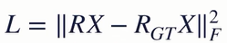
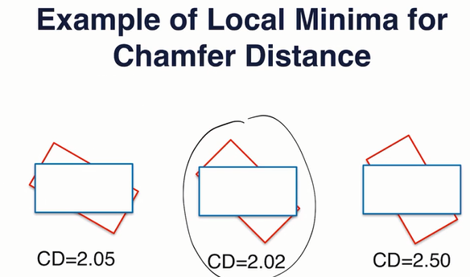
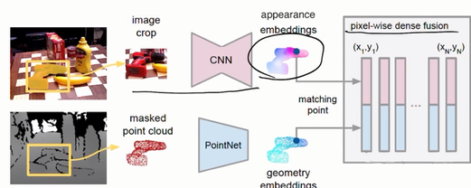
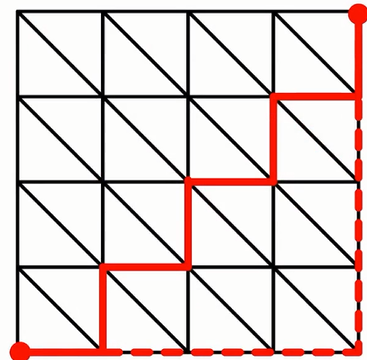
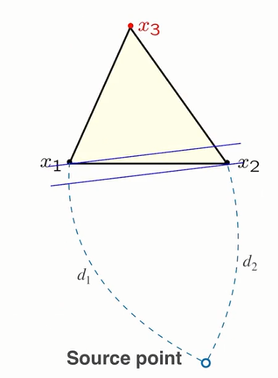
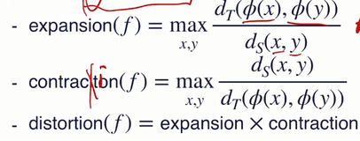
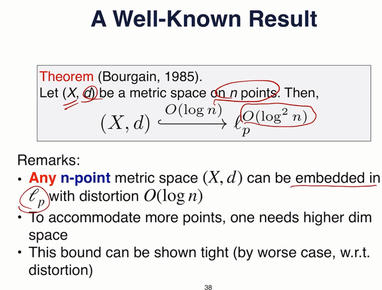

#### ICP：考虑的是配准问题

https://en.wikipedia.org/wiki/Iterative_closest_point

#### improve ICP

* 改变objective func：最近的两点-》最近的点和点的切面（即估计出法向量，然后即可计算）。收敛快，但要算法向量
* distance过大的点在估计rigid时去掉
* 有现成的PCL/Open3D
* 缺点：
  * 局部最优
  * 需要好的预先估计（因此最好作为refinement）
  * 预先估计：Go-ICP等

### estim 6D pose with learning

* 直接法：直接拟合T的参数
  * 此时输入也不一定就是点云，也可以是图片等
  * 如何表示R？即选择rotation representation
  * 一定要连续的！
  * 6D：任意六个实数，先两个正交化，然后再叉乘搞出第三维（注意最后还需要单位化使得det=1，因此其实还会缺一个自由度，即其实是5D）
  * 9D：就是类前，通过求优化问题得到最“接近”的R（其实就是SVD，然后把U和V^T一乘即可，如果det=-1则抽一列取负）
  * loss：
    * 注意：net预测结果不在SO3中（因为需要投影到SO3中），因此梯度方向可能并不沿着SO3的切向，而是可以沿着原来的6D或9D空间中的任意方向，虽然loss减小但是可能偏得越来越远
    * 两类：
    * 
    * shape-agnostic：
      * 问题：当物体本身具有对称性则可能gt有多个，但net只能优化到其中一个
      * 补救：
      * 
      * inf order：这个min就是0，即不考虑R的loss
      * 这种补救的问题：还是需要物体本身的（对称）信息，于是其实还不如直接用上shape-aware
    * shape-aware
      * 考虑对比作用了R和t后的shape的物体实际的差别
      * 
      * 有时我们已经知道前后的X指代同一物体，但是点云略有不同（例如有一个RX其实是template shape），则此时可以用前面的Chamfer/EMD等
      * 其实已经可以考虑到对称的问题（其实还是有点问题），但如果有对称信息则还是可以加上上面所述的min N，这样效果更好
      * 需要一个shape，且容易局部极小（CD的固有问题，见下例）
      * 
      * min N就不容易get stuck in local minimum
      * 示例：DenseFusion
      * 
      * 后面就是pointnet预测pose，分对称和不对称获取结果（**可能需要check一下细节**）
* 间接法：估计点对，然后解优化问题
  * 直接根据两组数据预测对应点的位置，而非从一个点向另一个点扫视预测
  * key pts in canonical frame+camera（kinect，etc）frame--predict--key pts in camera frame
  * instance specific，不是一般的网络——PVN3D
  * 选择1：bounding box的8个格点（为了使之对一类（bounding box大小略微不同的）形状都有效，则统一通过放缩把所有template放到单位立方体里面，然后据此预测的结果再叠加上放缩结果就是最终移动的结果）
  * 选择2：FPS等获取关键点
  * PVN3D：根据dense feature，对每个key pt做voting+clustering，从而预测出camera frame中key pt的位置
  * 如果想反过来，考虑在camera frame中取key pts然后在canonical frame中找对应，则可以用NOCS——把每个camera pixels都当做特征点
    * 对一类物体的pose，显然至多只有一部分object有template，故需要找到一类物体中的各个物体的template（没有就“想象一个”）之间的关系
    * 缩放，使得tight bounding box的对角线为1
    * 这里还需要补全。方法是不直接normalize看得到的点云，而是隐式地假设补全后的点云的中心在NOCS中的原点。而点在NOCS中的位置通过网络预测，于是直接获得的bound ing box一般不关于原点对称。此时直接在三个轴方向取最大值即可补全成一个在NOCS中对称的tight bounding box（amodel）
    * 由于有一个缩放，则其实R还有一个S（缩放**系数**，参考原论文https://opg.optica.org/josaa/abstract.cfm?uri=josaa-4-4-629），根据L7关于此问题的注记很容易推出R和s是相对独立的，可以先求最优的R（形式和没有s时相同），然后求s（是一个二次函数）（前提是约束s大于0，即不能翻转，这是合理的选择）
    * NOCS for symm objects：min N；对轴对称则近似为多边形有限对称

### L13 ：extrinsics & intrinsics

extrinsics：surface在空间中embedding的形式，怎么放，怎么弯曲，如pose、curvature、normal，mean curvature。。。

intrinsics：surface本质，如gaussian curvature

* geodensic distance（测地距离）唯一定义了intrinsics特征
* 类似一张纸怎么折都不改变intrinsic特征
* 有助于分类和获取correspondence

#### compute geodensic distance

* 注意：mesh上算geodensic distance要小心不能直接用dij
* 
* 需要用fast marching——一种dij的改进版本
* 假设：等距离线是一个平面
* 
* 当已知x1，x2到原点的最短路径的估计值为d1，d2，d1>d2，则根据假设分别过x1，x2两点做平行面且令其间距为d1-d2，再假设x1，x2，x3组成的三角形很小，则即可通过x3到平面的距离得到最短路径估计值
* 以上只是估计值，加一点改进就能成为精确的算法

更快的：learning：

* metrics（度量）
* 可以把surface映射到一个高维空间中的Lp距离，从而能够近似
* 维数足够高时也未必能找到这样一个Lp距离能够精准，因为有的surface从根本上和R^n不同胚（如球）（小心同胚（双射）和可微（定义域微移——值域微移）的区别）

embedding：

* 首先定义surface之间的映射$\phi$
* 
* distortion接近1则embedding较好
* 
* 点越多，往往要求更高的维度
* 这个distortion是上确界
* 因此只需要在邻域估算deodensic distance即可
