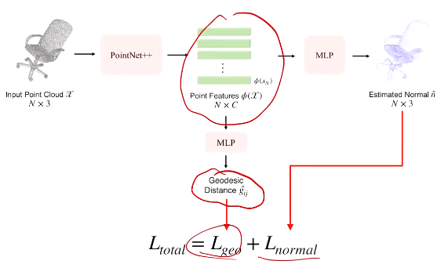
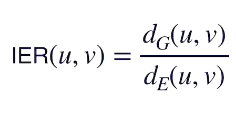
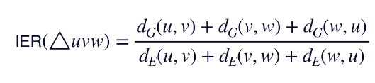

接上回：geodensic distance

fast marching——可以作为ground truth

distortion，Thm，local space geodensic distance

以下是示例：

#### GeoNets

* estimate geodesics for pt clouds in every cluster
* 第一步：pointnet++，每个点赋上特征向量（看成高维的embedding）
* 第二部：metric learning，连接两点的特征向量（和其中一个点的坐标）过MLP
* gt：用fast marching估计（因此mesh需要预处理，且需要搞成watertight（类似于没有洞，水流不到内部））
* 作用，训完了之后的pointnet++包含intrinsic信息，因此geodensics可以作为一个引导性的训练任务，得到的pointnet++网络可能对下游任务也有效
  * 示例：点云normal estim时用geodensic distance作为取点的尺度大小，这样不像欧氏空间中球容易取到不在表面附近的点
  * 进一步：直接预测normal，两个分支，loss也由两部分组成
  * 
  * 在curvature大，扭曲较大时用net能估计得更准
  * 容易生成consistant的normal（不容易突然180°翻转）（传统方法不容易保证）
* 作用二：可以用geodensics搞聚类

#### mesh reconstruction

* 简单的KNN方法：在邻域中搞一堆三角形，然后不断加三角形，并且检查manifold check
* 问题：容易把不同的表面（但欧氏距离较近时）连接在一起
* 标准：
* IER接近1时较可能在同一平面内
* 标准二：对三角形的评价
* 
* 当较为接近1时质量好
* 方法：在添加三角形扔掉IER太高的三角形，当然还有一些其他的优化筛选条件
* 当然还有Possion的方法（传统方法），关键是对normal的估计要准
* 其他的方法：当成解SDF来搞

*基础部分完毕*

### Part based 3D Analysis

* shape都是一块一块拼接起来的，零件geo较为简单
* 数据集：part net
* part不是一个类独立的概念，不同类的物体有可能有相同的part，体现了相同的交互功能
* 当然定义方式可能不同
* 问题：
  * part segmentation
  * part-based shape generation/reconstruction，可以保留part信息
    * 可以考虑分层级组成
    * 可以对part使用box，用来估计对称性等（当然也可以反过来，用对称性补全）
  * part relationship
  * part functionality
    * 如part grasping，究竟该抓哪儿
  * part mobility
    * 运动能力
    * 有数据集和模拟环境
  * interaction handle

part annotation & datasets

* 数据集：partnet，PSB（不唯一，分割线都带有概率），基于shapenet的part（较为粗粒度）
* partnet：与或图（例如chair需要包含back和arm（并列关系，但也不用都取到）——and，但chair base只用在几个part中选一个且只用一个——or）
* 然后可以定义part之间的关系（毗邻、对称、etc）

segmentation

* 和一般的segmentation一样
* 最大的区别：数据：有很多part之间关系的信息和上下文关系（即周围都有什么part，part不仅仅由geo信息解决）
* 利用上下文的方法示例：有一个分支过估计一大堆（如200个）备选part，每个都附带一个特征向量，然后和gt用softIoU估计置信度，用匈牙利算法搞匹配（和前面一样）；又有一个分支估计置信度，以便于test使用。由于有匹配过程，可能可以反映part之间的关系（当然理论并不strong，但是结果是较好的）
* 还有一个分支用于语义标注
* 再考虑：分层级segmentation
  * 假设没有or（方便起见，为了增加data reusing）
  * 限制子节点数量，从而以此完全树为canonical template
  * 简单的想法：top-down（先分粗糙的层，然后细分，问题是开头错了后面也会错）或bottum-up（先分最细，然后组合起来，问题是一开始最细不容易分）
  * 解决：每一层同时做，然后各层匹配（类似前面的方法），然后加一个子节点之和为父节点的constrain

part shape generation

* 过去的方法：整体做，细节不好
* part：局部可以更精细，自带语义信息
* semantic level：
  * generate part
  * predict pose/position
  * loss加约束
* hierarchical generation
  * VAE
  * encoder：找到leaf node——encoder——message passing（同层的节点相互传递特征，从而表征part之间的关系）——pooling，得到parent的表示——继续
  * 其实类似recersive net的结构
  * decoder：限定子节点数量——类似前面匹配的方式向下分析，同层之间还需判断part之间的关系
  * 一般是不同类不同训
  * 输入输出未必相同，例如encoder也可以使用对多视角图片的encoder
  * 另一种用处：part interpolation，part逐渐变化时VAE的输出能够给出更加reasonable的类似拓扑的变化
  * 注意encoder后的shape和structure的特征是分开的，因此插值时可以控制是想在哪一个特征上插值
  * part editing时可以帮助推导出更合理的整体结构
  * 问题：part之间可能没连接上——也有一些工作
