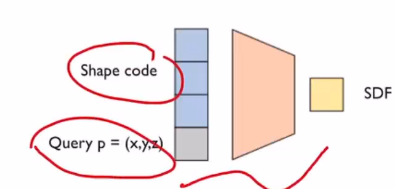
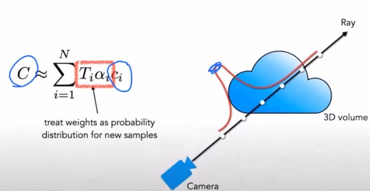

多目——3D

volumetric——低效

adaptive sampling

normal info

#### appearance

* why not use colors in the images？

  * it depends on material
  * reflection——blendering is wrong
  * resolution is low
* directly get rendered imgs，no 3D geo generated（though we can derive 3D stuff from rendered imgs）
* last：voxel,RGB+$\alpha$

  * storage high
  * no reflection info (no derection)

#### implicit representation

* Signed Distance Field

  * 
  * easy to do operation between shapes
  * grad of sdf=normal direction
  * 必须有内外
  * need extra steps to visualize
* mixture of gaussians
* ray marching

  * 
  * SDF——rendered img
* DeepSDF

  * stores the data,directly learn SDF
  * shape code: which geo object is needed,differs SDF
  * 
  * so we can represent a **class** of 3D objects
  * 还可以有更多code！

#### ray marching

* for each pixel, color is integral of ray
* the same is done in L4
* what do the nets do? approximate F:
* 
* the net is specific to a scene
* camera parameters needed

#### Tricks

* hierarchical sampling (on each ray)
  * 
  * 表面附近更加密集
* positional encoding
  * 把5D自变量做离散傅里叶变换，更好地处理细节

#### more

* how to generate to dynamic scenes (not one net per frame!)
* D-Nerf: for dynamic scenes

  * predict the deformation refed to t=0 with x(5D) and t
  * predict phonic params with x ( deformation operated)
* deformable NeRF

  * make the points on the ray can be changed through MLP (with deformation code) so the ray (inte path) can be any curve
  * deformation code is predicted by other model (so time is not the input, the time dependency is not learned)
  * can operate on real data
* PixelNerf

  * conv -- feature vec for each pixels -- input 5D position with feature
  * prior in conv, so can use less images (for example 3 img is enough)
